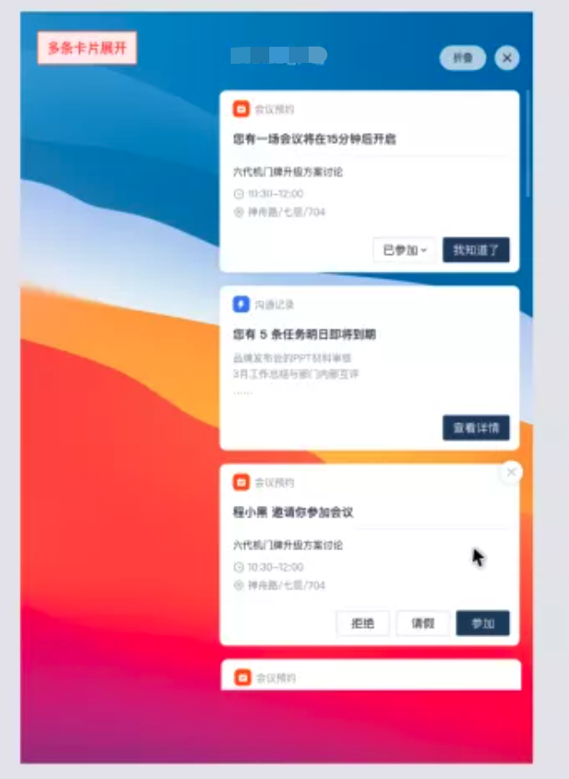
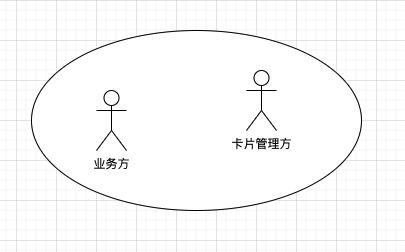
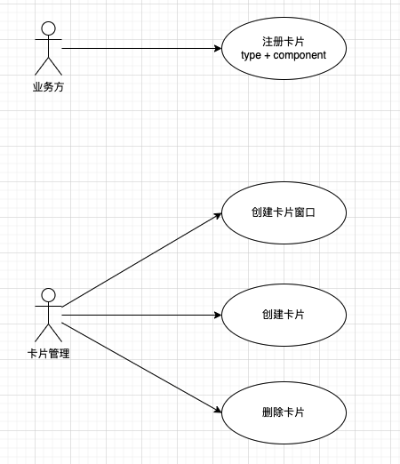
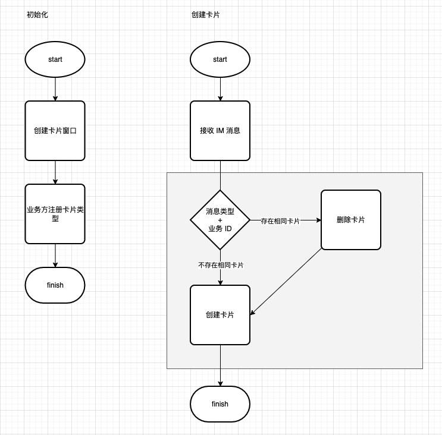
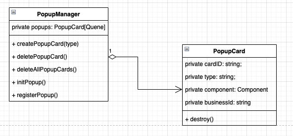

## Todo 前端整洁架构

在很久很久之前，页面是后端直出的，比如流行的 JSP，顶多加上模板语言。随着前后端分离模式的流行，以及后台服务逐渐趋于微服务化，越来越多的业务逻辑迁移到前端，前端从瘦变得越来越来胖。但是传统的开发模式依然在持续，面向过程式的设计风格充斥在前端的代码中，即使是使用了 react、VUE 等前端框架，也很难见到设计良好的代码。就现阶段而言，前端应用的复杂性体现在两方面，一方面是需要满足业务（Business）需求，一方面是需要实现复杂（多变）的展示（View）需求。

针对这两方面，基于关注点分离的原则，在设计上我们要将业务和展示分开。

首页进行业务设计，业务设计可以参考 DDD 设计原则，通过分析系统角色、角色用例、关键流程、业务领域进行。比如我们要实现一个基于 electron 的弹窗通知能力，需求如下。

第一步：识别系统角色

第二步：识别关键用例

第三步：业务关键流程

第四步：领域模型

